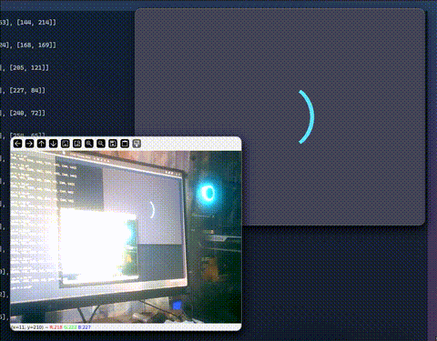

# Aro Interactivo con ModernGL



Este proyecto es un **renderizador 3D interactivo** escrito en Python usando **ModernGL** y **Pyglet**, que implementa *ray marching* para mostrar un aro en 3D con rotación en tiempo real.
Permite modificar en vivo tanto la rotación de la **vista** como la del **objeto** mediante comandos desde la terminal.

---

## Características

* Renderizado en **OpenGL moderno** usando *shaders* GLSL.
* Control en tiempo real de **rotación de cámara** y **rotación del objeto**.
* Implementación de *ray marching* para generar el aro.
* Arquitectura multihilo para captura de comandos mientras se renderiza.

---

## Uso

Ejecuta el script principal:

```bash
python main.py
```

En la terminal, tambien se puede controlar la rotación usando el formato:

```
[v/o][x/y/z] [grados]
```

* **v** → Rotar vista (cámara)
* **o** → Rotar objeto
* **x, y, z** → Eje de rotación
* **grados** → Ángulo de rotación

Ejemplos:

```
vy 45   # Rotar vista 45° en eje Y
ox 90   # Rotar objeto 90° en eje X
```

---

## Controles en tiempo real

* La rotación se actualiza inmediatamente al ingresar el comando.
* El render no se detiene mientras se interactúa.
* Es posible cambiar múltiples ejes durante la ejecución.


## Licencia

MIT © Pluf Creations

